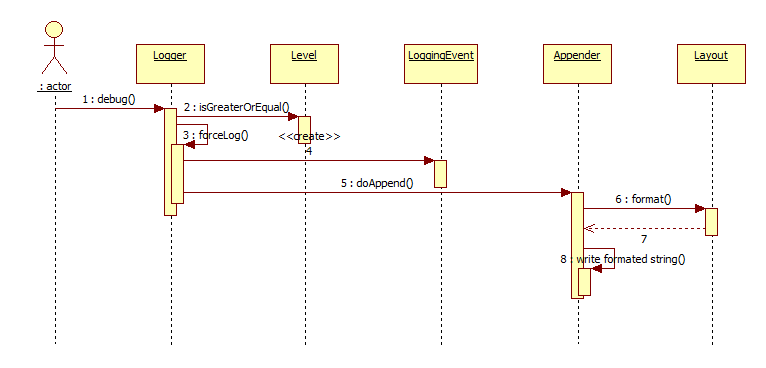
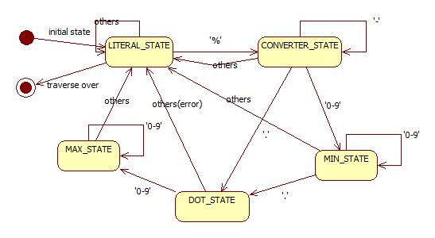

log4j的源码导读，所有的笔记导读都写在测试用例中，这里做个测试用例导读吧：

TestLogHelloWorld：主要是log4j的基础知识，基本使用，基本看一眼就懂了,里面有五篇博客，本次源码导读都是在博客基础上延伸出来的，
其中第一篇博客模拟了个log4j的实现，如果实现一遍其实大致原理都会好明白很多。

logger.TestLogger:在大致了解log4j后，应该进入的就是源码的debug中，可以从TestLogHelloWorld的log.info中打个断点，然后看
方法堆栈，结合博客的内容，源码并不难看懂，而且在源码中也有大量笔记引导,流程图可以参考下列流程图进行debug细看：

logger.TestFilter:大致看懂流程后，这个测试用例主要是列出的所有filter的使用例子，原理

layout.TestLayoutDemo:这个测试用例覆盖了所有log4j的layout用法，原理解析，layout是log4j比较重要的，负责将信息格式化为一行日志进行输出

layout.TestLayoutThread:这个测试用例重现了官方文档中的，为什么说最常用的PatternLayout是线程不安全的问题。

layout.TestNDCAndMDCTest:这个测试用例中主要是描述log4j中的NDC和MDC，其中MDC用到了InheritableThreadLocal类，需要注意一下

然后就是log4j中负责日志输出的模块，测试用例都在appender包中
appender.AppenderTest:这个测试用例基本描述了所有的appender的用法，原理
appender.SockerAppenderTest:这个测试用例则是通过socket传输日志的示例

看完了appender，就剩下了log4j的配置阶段，即log4j的初始化阶段，都在configuration包中
configuration.ConfigurationTest:主要是描述如何去创建logger，维护logger，和一些事件发生的监听器，原理和解析都有涉及

我觉得在阅读完一个框架的设计、具体实现过后，如果要真正的理解一个框架，应该可以说出这个框架的优点和缺点，首先先说log4j的优点吧，首先
我觉得需要明白，log4j的出来的时候JUC似乎是还没有出现的，因此有很多涉及并发的设计，虽然现在来看可能会有些缺点，但是在那时候必定是一个
比较好的实现，这里先描述我觉得写的比较好的地方：

1.在AsyncAppender的实现中，即异步appender的实现中，就是异步的调用Appender中的doAppend()方法，如果现在大部分都会使用blockingqueue
来实现，但是log4j的实现远早于blockingqueue出来的版本，而且log4j2也使用了更高级的disruptor实现，在第一版的实现，log4j实现了一个
非常标准的生产者消费者队列，而且结合了缓冲区进行使用，同时，考虑到了并发的问题，做了许多的补偿处理，如异步线程异常时则使用同步处理，
分派线程被打断时尽量不损失日志事件，美中不足的是虽然还有一些bug，但是设计的我个人觉得是不错的。

2.缓冲区的设计，log4j的实现里有许多缓冲区的设计，有印象的有AsyncAppender、JDBCAppender（虽然比较鸡肋）、LoggerRepository的
缓冲logger，包括缓冲可能的父节点设计、CategoryKey，缓冲hashcode，以免重复计算hashcode浪费性能；以上是我比较有印象的缓冲设计，我
觉得在这些细节上，log4j还是做的比较好的。

3.PatternLayout的实现，PatternLayout的实现采用了类似正则表达式的这种形式，让用户可以设定自己的日志可以输出自己想要的内容，可以说
是一种非常灵活的设计；同时在解析方面，为了不浪费性能，采取了有限状态机的形式进行解析，会将字符串解析为一条链，这条链在后面的日志记录即
layout中就会对每条日志进行链式处理，可以参考下图：

4.logger中的父子logger的设计，虽然这个功能很少用到，也是一个可能会导致线程安全问题的设计，但我感觉设计的还是可以的，通过.进行分隔
确定父子logger，其中如何解析父子logger的问题log4j设计的我觉得是比较好的，通过前置节点的设计结合缓存的设计，完美的解决了父子logger
的解析

5.我觉得一个框架是否称的上一个好框架，最重要的除了使用的便利、还有一点就是框架的拓展性，我看过的设计的最好的拓展性框架就是spring的设
计，拓展的实现充满在整个框架中；log4j可以让用户便捷的通过配置文件，轻松的决定日志的输出、格式等方式，在便捷方面可以说是设计的很好了，
但拓展我觉得也不应该被忽略，log4j也设计出了许多拓展的实现，虽然达不到spring那样的严谨，比如日志内容的解析、throwable的渲染、Filter
的设计、appender的设计、layout的设计、父子logger之间的解耦、我觉得在这上面还是设计的挺严谨的。

说完了优点接下来就是缺点了，其实缺点也非常明显，就是性能，log4j的日志打印是通过synchronized来完成的，其中synchronized锁的是父logger
，大部分的logger，的父logger都是rootlogger，那么可以说，log4j的日志打印，实际上是串行打印的，如果使用了多层级的父子logger关系的
时候，就会出现比较多的线程安全问题，比如PatternLayout中的乱序问题、RollFileAppender的多线程操作同一个文件的问题、虽然log4j通过
补偿措施，让当发生这些情况的时候，程序都能有序的进行，但是不知道在结合业务之后会有什么样的不确定性，（虽然log4j2已经全部改良了，
但这里还是要简单描述一下）
 